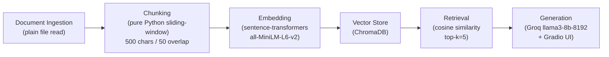

# Project 1 Planning: The Unofficial Guide

> Write this document before you write any pipeline code.
> Your spec and architecture diagram are what you'll use to direct AI tools (Claude, Copilot, etc.) to generate your implementation — the more specific they are, the more useful the generated code will be.
> Update the Retrieval Approach and Chunking Strategy sections if you change your approach during implementation.
> Update this file before starting any stretch features.

---

## Domain

<!-- What domain did you choose? Why is this knowledge valuable and hard to find through official channels? -->
I chose the topic SEO, SEO itself cannot be answered in one article but the combination of these articles help you understand technical SEO, On page SEO, Off page SEO, and emerging search trends such as AEO.

---

## Documents

<!-- List your specific sources: URLs, subreddit names, forum threads, or file descriptions.
     Aim for at least 10 sources that together cover different subtopics or perspectives within your domain. -->

| # | Source | Description | URL or location |
|---|--------|-------------|-----------------|
| 1 |Airops | Answer Engine Optimization (AEO): Your Complete Guide for 2026 | https://www.airops.com/blog/aeo-answer-engine-optimization | 
| 2 | CXL | Answer Engine Optimization (AEO): The comprehensive guide for 2026 | https://cxl.com/blog/answer-engine-optimization-aeo-the-comprehensive-guide/ |
| 3 | Google | Search Engine Optimization (SEO) Starter Guide | https://developers.google.com/search/docs/fundamentals/seo-starter-guide |
| 4 | Ahrefs | How to Do Keyword Research for SEO (Start to Finish) | https://ahrefs.com/seo/keyword-research |
| 5 | Webflow | Schema markup explained: Enhancing SEO and AEO with structured data | https://webflow.com/blog/schema-markup |
| 6 | Elementera | Schema markup for AEO: the structured data strategy that gets your brand cited by AI | https://www.elementera.com/blog/schema-markup-for-aeo-seo-geo-ai-seo |
| 7 | AlmCorp | Core Web Vitals 2026: Technical SEO That Actually Moves the Needle | https://almcorp.com/blog/core-web-vitals-2026-technical-seo-guide/ |
| 8 | Creative Corner | SEO vs AEO vs GEO: An Honest 2026 Comparison. | https://www.creativecorner.studio/blog/seo-vs-aeo-vs-geo |
| 9 | Writesonic | GEO vs SEO: Key Differences, Strategies & Why Both Matter | https://writesonic.com/blog/geo-vs-seo |
| 10 | Google | Get started with Search: a developer's guide | https://developers.google.com/search/docs/fundamentals/get-started-developers |

---

## Chunking Strategy

<!-- How will you split documents into chunks?
     State your chunk size (in tokens or characters), overlap size, and explain why those
     numbers fit the structure of your documents.
     A review-heavy corpus warrants different chunking than a long FAQ. -->

**Chunk size:**
500

**Overlap:**
50

**Reasoning:**
Since documents are pre-saved as plain `.txt` files, ingestion is a direct file read — no scraping needed. Character-based chunking at 500 chars with 50-char overlap is implemented in pure Python (no LangChain dependency). The 500-char size fits 2–4 paragraphs typical of these blog articles; the 50-char overlap prevents sentences from being cut at boundaries without duplicating too much content.

Mileston 3: 628 chunks across 10 documents.

---

**Update after testing:**
Switched to paragraph-aware splitting. Testing showed that 3 out of 5 sampled character-based chunks started mid-sentence or mid-word, meaning they could not stand alone — a retriever hitting those chunks would return broken context to the model.

The revised approach splits on `\n\n` first to get natural paragraph units, then groups consecutive paragraphs until the total reaches ~500 chars. Overlap is handled by carrying the last paragraph of each group into the start of the next. This guarantees every chunk starts and ends at a paragraph boundary.

One additional fix: chunks under 100 chars (typically section headers with no body text) are filtered out before storage, since they contain no answerable content and would waste a retrieval slot.

---

## Retrieval Approach

<!-- Which embedding model are you using (e.g., all-MiniLM-L6-v2 via sentence-transformers)?
     How many chunks will you retrieve per query (top-k)?
     If you were deploying this for real users and cost wasn't a constraint, what tradeoffs
     would you weigh in choosing a different embedding model — context length, multilingual
     support, accuracy on domain-specific text, latency? -->

**Embedding model:**
all-MiniLM-L6-v2

**Top-k:**
5

**Production tradeoff reflection:**
- **Accuracy:** MiniLM is a general-purpose model; a domain-specific model like `text-embedding-3-large` would handle SEO jargon (E-E-A-T, LCP, schema types) more precisely but costs more per query.
- **Context length:** 500-char chunks fit blog paragraphs well, but a model supporting longer inputs (e.g., `text-embedding-ada-002` at 8191 tokens) could embed full sections and preserve more context per chunk.
- **Latency vs accuracy:** MiniLM runs locally with no network overhead; switching to an API-based embedding model adds latency on every query — an important tradeoff when users expect near-instant answers.
---

## Evaluation Plan

<!-- List your 5 test questions with their expected correct answers.
     Questions should be specific enough that you can judge whether the system's response
     is right or wrong. "What are good dining halls?" is too vague.
     "What do students say about wait times at [dining hall name] during lunch?" is testable. -->

| # | Question | Expected answer |
|---|----------|-----------------|
| 1 | What percentage of Google searches were zero-click in 2025?  | 69% (sourced from the CXL AEO guide)  |
| 2 | What is the difference between AEO and GEO? | AEO (Answer Engine Optimization) targets AI systems that return direct answers to questions (e.g., voice assistants, featured snippets); GEO (Generative Engine Optimization) targets AI-generated responses in tools like ChatGPT and Perplexity, optimizing for brand mentions and citations within longer generated text. AEO focuses on being the answer; GEO focuses on being cited within the answer. |
| 3 | What schema markup type should you use for FAQ content? | `FAQPage` structured data, which wraps Q&A pairs in a machine-readable format AI systems use directly  |
| 4 | What are the three Core Web Vitals metrics?  | LCP (Largest Contentful Paint), INP/FID (Interaction to Next Paint), and CLS (Cumulative Layout Shift) |
| 5 | What does Google's SEO Starter Guide say about structured data and search appearance? | Valid structured data makes pages eligible for rich results (review stars, carousels) in Google Search |

---

## Anticipated Challenges

<!-- What could go wrong? Name at least two specific risks with reasoning.
     Consider: noisy or inconsistent documents, missing source attribution, off-topic
     retrieval, chunks that split key information across boundaries. -->

1. **Chunk boundary splitting definitions:** SEO concepts like "E-E-A-T" or "Core Web Vitals" are often defined across 2–3 sentences that span a chunk boundary. The retriever may return a chunk with only half the definition, causing the model to produce an incomplete or inaccurate answer even when the source document contains the full explanation.

2. **Semantic overlap between documents:** All 10 sources cover overlapping terms (e.g., "structured data", "schema markup"). The top-5 retrieved chunks may all surface chunks that say roughly the same thing from different articles, crowding out more specific or unique information and making answers repetitive rather than comprehensive.

---

## Architecture

<!-- Draw a diagram of your pipeline showing the five stages:
     Document Ingestion → Chunking → Embedding + Vector Store → Retrieval → Generation
     Label each stage with the tool or library you're using.
     You can use ASCII art, a Mermaid diagram, or embed a sketch as an image.
     You'll use this diagram as context when prompting AI tools to implement each stage. -->

---

## AI Tool Plan

<!-- For each part of the pipeline below, describe:
     - Which AI tool you plan to use (Claude, Copilot, ChatGPT, etc.)
     - What you'll give it as input (which sections of this planning.md, which requirements)
     - What you expect it to produce
     - How you'll verify the output matches your spec

     "I'll use AI to help me code" is not a plan.
     "I'll give Claude my Chunking Strategy section and ask it to implement chunk_text()
     with my specified chunk size and overlap" is a plan. -->

**Milestone 3 — Ingestion and chunking:**
I'll give Claude this Chunking Strategy section and the Documents table and ask it to implement `ingest.py` with two functions: `load_documents(folder: str) -> list[dict]` (reads every `.txt` file from `documents/`, returns list of `{source, text}`) and `chunk_text(text, chunk_size=500, overlap=50) -> list[str]` (pure Python sliding-window). I'll verify by running it on one txt file, printing chunks, and confirming sizes are ≈500 chars and adjacent chunks share ~50 chars.

**Milestone 4 — Embedding and retrieval:**
I'll give Claude the Retrieval Approach section and the `ingest.py` output from Milestone 3 and ask it to implement `retrieve.py` with `embed_and_store(chunks)` (sentence-transformers `all-MiniLM-L6-v2` → ChromaDB collection) and `query(text, k=5) -> list[str]` (cosine similarity lookup). I'll verify by running evaluation question #1 ("What percentage of Google searches were zero-click in 2025?") and confirming the returned chunks include the 69% figure from the CXL source.

**Milestone 5 — Generation and interface:**
I'll give Claude the Evaluation Plan (all 5 questions + expected answers) and the `retrieve.py` output and ask it to implement `app.py`: a Gradio UI with a text input that calls `query()`, formats a RAG prompt, sends it to Groq (`llama3-8b-8192`), and streams the answer back. I'll verify by running all 5 evaluation questions and checking responses against expected answers.
